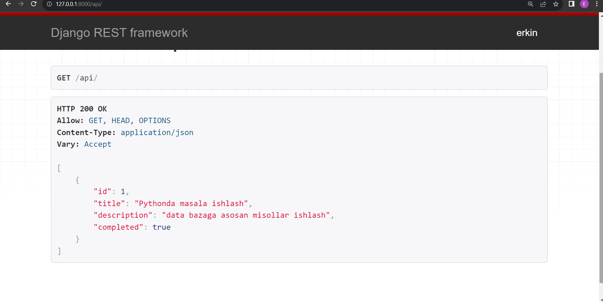

# RESTful Todo Program

This program is a Todo program that allows people to mark and execute tasks that they need to do!

## Usage

In this program, you can perform various actions using different HTTP methods on the `/api/` endpoint:

- **GET** `/api/`: Retrieve all items.
- **POST** `/api/new`: Add a new item.
- **PUT** `/api/id/update/`: Update an item with the specified ID.
- **DETAIL** `/api/id`: Partially update an item with the specified ID.
- **DELETE** `/api/id/delete`: Delete an item with the specified ID.

Depending on the type of request, different functions will be activated to handle the corresponding action.

I hope you find this program useful! If you have any questions or feedback, feel free to contact this [Telegram account](t.me/am1rov_008)!

## Creator

Created by AMIROV ERKINBEK

